<!DOCTYPE html>
<html lang="ro">
<head>
    <meta charset="UTF-8">
</head>
<body>
<article>
    <header>
        <h1>
            UnX (Unemployment Explorer)
        </h1>
    </header>
    <h2>Cuprins</h2>
    <ul>
        <li>
            <a href="#authors">Autori</a>
        </li>
        <li>
            <a href="#introduction">1. Introducere</a>
            <ul>
                <li><a href="#introduction-purpose">1.1 Scop</a></li>
                <li><a href="#conventions">1.2 Convenție de scriere</a></li>
                <li><a href="#audience">1.3 Publicul țintă</a></li>
                <li><a href="#product-scope">1.4 Scopul produsului</a></li>
                <li><a href="#references">1.5 Referințe</a></li>
            </ul>
        </li>
        <li><a href="#overall">2. Descriere Generală</a>
            <ul>
                <li><a href="#product-perspective">2.1 Perspectiva produsului</a></li>
                <li><a href="#product-functions">2.2 Funcțiile produsului</a></li>
                <li><a href="#users">2.3 Clase și caracteristici ale utilizatorilor</a></li>
                <li><a href="#operating-environment">2.4 Mediul de operare</a></li>
                <li><a href="#documentation">2.5 Documentația pentru utilizator</a></li>
            </ul>
        </li>
        <li><a href="#external">3. Interfețele aplicației </a>
            <ul>
                <li><a href="#user-interface">3.1 Interfața utilizatorului </a>
                    <ul>
                        <li><a href="#nav-bar">3.1.1 Bara de navigație </a></li>
                        <li><a href="#login-page">3.1.2 Pagina de autentificare </a></li>
                        <li><a href="#signup-page">3.1.3 Pagina de înregistrare </a></li>
                        <li><a href="#home-page">3.1.6 Pagina de acasă </a></li>
                        <li><a href="#gender-age-reports">3.1.7 Paginile de age și gender reports</a></li>
                        <li><a href="#timeTracking">3.1.8 Pagina cu graficul</a></li>
                        <li><a href="#map">3.1.9 Pagina cu harta Romaniei</a></li>
                        <li><a href="#all-data">Pagina principală Unemployment Data </a></li>
                        <li><a href="#about">3.1.11 Pagina informativa </a></li>
                    </ul>
                </li>
                <li><a href="#hardware-interface">3.2 Interfața Hardware </a></li>
                <li><a href="#software-interface">3.3 Interfața Software</a></li>
                <li><a href="#communication-interface">3.4 Interfața de comunicare</a></li>
            </ul>
        </li>
        <li><a href="#system-features">4. Caracteristici ale sistemului</a>
        </li>
        <li><a href="#non-functional">5.Funcționalități pentru protecție și securitate</a>
            <ul>
                <li><a href="#safety">5.1 Protecția datelor</a></li>
                <li><a href="#security">5.2 Securizarea datelor</a></li>
                <li><a href="#software-attributes">5.3 Calitățile Software </a></li>
            </ul>
        </li>
    </ul>
    

        <section id="authors" typeof="sa:AuthorsList">
            <h2>Autori</h2>
            <ul>
                <li property="schema:author" typeof="sa:ContributorRole">
            
              <meta content="Laura" property="schema:givenName">
              <meta content="Florina" property="schema:additionalName">
              <meta content="Chiriac" property="schema:familyName">
              Chiriac Laura-Florina
            
                    <ul>
                        <li property="schema:roleContactPoint" typeof="schema:ContactPoint">
                            <a href="mailto:aprofireiadrianmihai1@gmail.com" property="schema:email">laurachiriac.cl@gmail.com</a>
                        </li>
                    </ul>
                </li>
                <li property="schema:author" typeof="sa:ContributorRole">
            
              <meta content="Sebastian" property="schema:givenName">
              <meta content="Stanciu" property="schema:familyName">
              Stanciu Sebastian
            
                    <ul>
                        <li property="schema:roleContactPoint" typeof="schema:ContactPoint">
                            <a href="mailto:tudor.stefan.paulet@gmail.com" property="schema:email">sebastian.stanciu.20@gmail.com</a>
                        </li>
                    </ul>
            </ul>
        </section>
    

    <section id="introduction">
        <h3>1. Introducere</h3>
        <section id="introduction-purpose">
            <h4>1.1 Scop</h4>
            

                UnX (Unemployment Explorer) este o aplicație web dezvoltată de studenții menționați în secțiunea
                de Autori de la Facultatea de
                Informatică a Universității Alexandru Ioan Cuza.
                Scopul acestui document este acela de a prezenta o descriere detaliată a funcționalităților, precum și
                de a specifica cerințele aplicației web. Această aplicație va oferi utilizatorilor posibilitatea vizualizării prin diferite metode și în mai multe formate a unor infografice ce prezintă date statistice despre șomajul din România, dar și metode de comparare mai facilă a datelor.
            

        </section>
        <section id="conventions">
            <h4> 1.2 Convenția documentului</h4>
            <ul>
                <li>
                    Acest document urmează șablonul de documentație a cerințelor software conform IEEE Software
                    Requirements
                    Specification.
                </li>
                <li>
                    Textul <b>îngroșat</b> este folosit pentru a defini noțiuni personalizate sau pentru a accentua
                    concepte
                    importante.
                </li>
            </ul>
        </section>
        <section id="audience">
            <h4>1.3 Publicul țintă</h4>
            

                Acest document este destinat profesorilor, studenților sau dezvoltatorilor, însă orice utilizator,
                indiferent
                de cunoștințele lor tehnologice,
                poate consulta secțiunile de <b>Interfeța utilizatorului</b> și <b>Caracteristici ale sistemului</b>
                pentru a
                obține o mai bună înțelegere a ceea ce oferă aplicația.
            

        </section>
        <section id="product-scope">
            <h4>1.4 Scopul Produsului</h4>
            

                Scopul aplicației este acela de a oferi utilizatorilor date exacte și corecte despre șomajul din România, dar și de a oferi metode de vizualizare moderne a acestor date statistice. Utilizatorii doritori să afle anumite informații și să primească date exacte și actualizate constant despre piața muncii din România se pot bucura de o multitudine de funcționalități care i-ar putea ajuta să descopere datele de care au nevoie dar și să aibă un outlook asupra influențelor sociale din sfera muncii. De asemenea, utilizatorii își pot crea un cont
                pentru a
                beneficia de restul funcționalităților UNX Romania, în special de cea de "Community Reports".
            

        </section>
        <section id="references">
            <h4>1.5 Bibliografie</h4>
            <ul>
                <li>Buraga Sabin-Corneliu, Site-ul Tehnologii Web, FII UAIC</li>
                <li>H Rick. IEEE-Template - GitHub</li>
            </ul>
        </section>
    </section>
    <section id="overall">
        <h3>2. Descriere Generală</h3>
        <section id="product-perspective">
            <h4>2.1 Perspectiva produsului</h4>
            
UNX Romania este o aplicație dezvoltată în cadrul cursului de Tehnologii Web,
                menită să ofere informații relevante despre șomajul din România și despre tendințele din această sferă.
        </section>
        <section id="product-functions">
            <h4>2.2 Funcționalitățile produsului</h4>
            Fiecare utilizator va avea acces la urmatoarele funcționălități:
            <ul>
                <li>să se înregistreze pe site.</li>
                <li>să se autentifice pe site.</li>
                <li>să își reseteze parola in cazul in care a uitat-o.</li>
                <li>să consulte pagina "Acasă" și noutățile disponibile</li>
                <li>să acceseze pagina "Unemployment Data" pentru a accesa toate datele relevante de pe site</li>
                <li> să acceseze paginile de "About" si "Contact" pentru a avea o mai bună perspectivă asupra surselor de informare folosite de site</li>
                <li>să acceseze paginile "Gender Reports" și "Age Reports" pentru a vizualiza datele statistice în funcție de gen și vârstă</li>
                <li>să acceseze pagina "All Collected Data" pentru a vedea toate datele de care ar putea avea nevoie mai ușor</li>
                <li>să acceseze pagina "Time Tracker" pentu a vedea un grafic interactiv în legătură cu șomajul din România și evoluția datelor în timp </li>
                <li>dacă este <b>autentificat</b>, să acceseze pagina "Community Reports" dacă vrea să facă o actualizare a datelor și să ofere informații actualizate și celorlalți utilizatori</li>
                <li>dacă este <b>autentificat</b>, să își acceseze profilul și sa verifice statisticile personale</li>
                <li>dacă utilizatorul are rol de <b>admin</b>, acesta poate șterge utilizatori din baza de date</li>
                <li>dacă utilizatorul are rol de <b>admin</b>, acesta poate aproba report-uri noi</li>
                <li>dacă utilizatorul are rol de <b>admin</b>, acesta poate modifica și actualiza informații de pe site, resurse, sau poate șterge informații eronate de pe site</li>
            </ul>
        </section>
        <section id="users">
            <h4>2.3 Clase și caracteristici ale utilizatorilor</h4>
            <h5>2.3.1 Utilizator principal</h5>
            <ul>
                <li>utilizatorii autentificați pot fi:</li>
                <li style="list-style: none">
                    <ul>
                        <li>orice categorie de oameni care doresc să vizualizeze informații mai detaliate și să facă anumite report-uri pentru a ajuta la actualizarea datelor</li>
                        </li>
                    </ul>
                </li>
                <li>
                    utilizatorii neautentificați pot fi:
                    <ul>
                        <li> orice categorie de oameni care doresc să acceseze câteva date de pe site despre șomaj</li>
                        </li>
                    </ul>
                </li>
            </ul>
            <h5>2.3.2 Caracteristici</h5>
            <ul>
                <li>Utilizatorii care sunt <b> autentificați </b> pot accesa pagină de "Acasă", "Time Tracker", "Unemployment Data", ș.a.m.d., dar cel mai important, pot accesa pagina de "Community Reports" pentru a oferi informații actualizate și pentru a face report-uri noi.</li>
                </li>
                <li>Utilizatorii care nu sunt autentificați pot să vizualizeze și ei datele despre șomaj de pe site, dar diferența principală este că nu au dreptul să contribuie.
                Așadar, aceștia pot să se înregistreze ca și utilizator și să beneficieze de toate
                funcționalitățile, inclusiv cea de a face report-uri noi și de a contesta informații deja apărute pe site.</li>
                </li>
            </ul>
        </section>
        <section id="operating-environment">
            <h4>2.4 Mediul de operare</h4>
            

                Produsul dezvoltat poate fi utilizat pe orice dispozitiv cu un browser web care suportă HTML5, CSS și JavaScript.
            

        </section>
        <section id="documentation">
            <h4>2.5 Documentația pentru utilizator</h4>
            

                Utilizatorii pot consulta acest document pentru explicații detaliate despre funcționalitățile aplicației
                web.
            

        </section>
    </section>
    <section id="external">
        <h3>3. Interfețele aplicației</h3>
        <section id="user-interface">
            <h4>3.1 Interfața utilizatorului</h4>
            Mai jos, puteți vedea o prezentare generală a fiecărei pagini a aplicației și funcționalităților pe care le
            oferă:
            <ul>
                <li id="nav-bar"><b>Bara de navigație</b></li>
                <li style="list-style: none">
                    <ul>
                        <li>Aceasta reprezintă meniul de navigare către fiecare pagină principală a aplicației, prezent pe fiecare
                        pagină totodată (în afară de cele pentru autentificare).
                        </li>
                        <li class="pictures" style="list-style: none"></li>
                    </ul>
                </li>
                <li id="login-page"><b>Pagina de autentificare</b></li>
                <li style="list-style: none">
                    <ul>
                        <li>Pagina are rolul de a realiza autentificarea utilizatorilor la UnX.</li>
                        <li>Pentru a se autentifica, utilizatorul trebuie să completeze câmpurile de "username" și
                            "parolă" cu
                            credențiale <b>valide</b>, urmând să acționeze butonul <b>Log in</b>.
                        </li>
                        <li> În cazul în care utilizatorul nu are cont pe site, acesta își poate crea unul prin
                            accesarea pagini de
                            înregistrare, ce se face prin apăsarea butonului <b>Register</b>.
                        </li>
                        <li> În cazul în care utilizatorul și-a uitat parola, acesta poate să o reseteze selectând
                            opțiunea de
                            <b>Forgotten password</b></li>
                        <li class="pictures" style="list-style: none">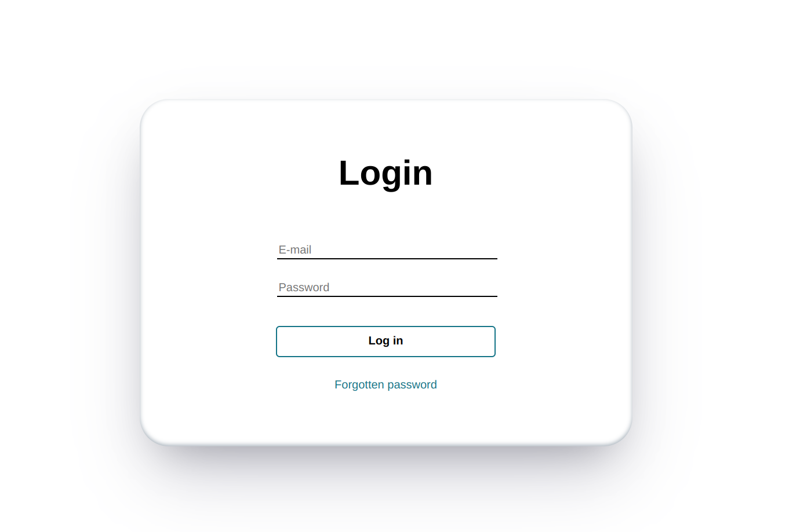
                        </li>
                    </ul>
                </li>
                <li id="signup-page"><b>Pagina de înregistrare</b></li>
                <li style="list-style: none">
                    <ul>
                        <li>Pagina oferă funcționalitatea de înregistrare a utilizatorilor, pentru a putea beneficia de
                            toate
                            funcționalitățile UnX.
                        </li>
                        <li>Pentru a se înregistra, utilizatorul trebuie să completeze câmpurile <b>Email</b> și <b>Parola</b>. Mai mult, câmpurile <b>Email</b> și
                            <b>Parola</b>
                            trebuie să fie <b>unice</b> si valide - adica e-mail-ul să fie valid și cea de a doua introducere a parolei să coincidă cu prima.
                        </li>
                        <li class="pictures" style="list-style: none">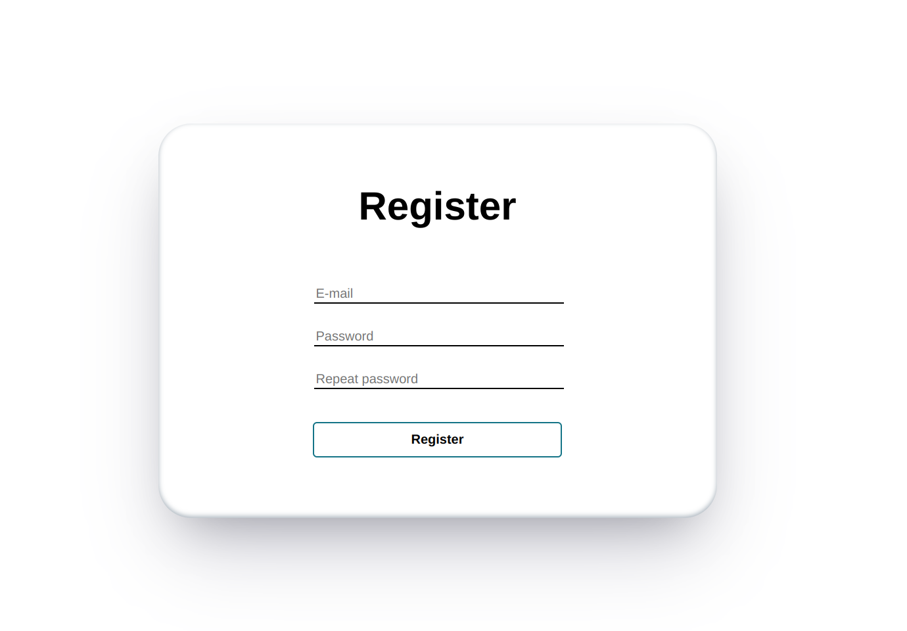
                    </ul>
                </li>
                <li id="home-page"><b> Pagina de acasă</b></li>
                <li style="list-style: none">
                    <ul>
                        <li>Pagina are rolul de prezența puțin site-ul noilor utilizatori și, eventual, de a afișa ultimele noutăți sau informații actualizate.</li>
                        <li class="pictures" style="list-style: none">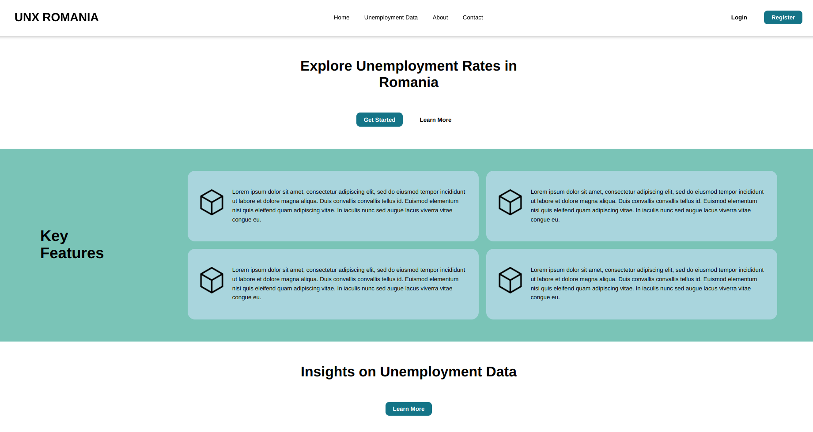
                        </li>
                    </ul>
                </li>
                <li id="gender-age-reports"><b>Paginile de comparare pe bază de gen și vârstă</b></li>
                <li style="list-style: none">
                    <ul>
                        <li class="pictures" style="list-style: none">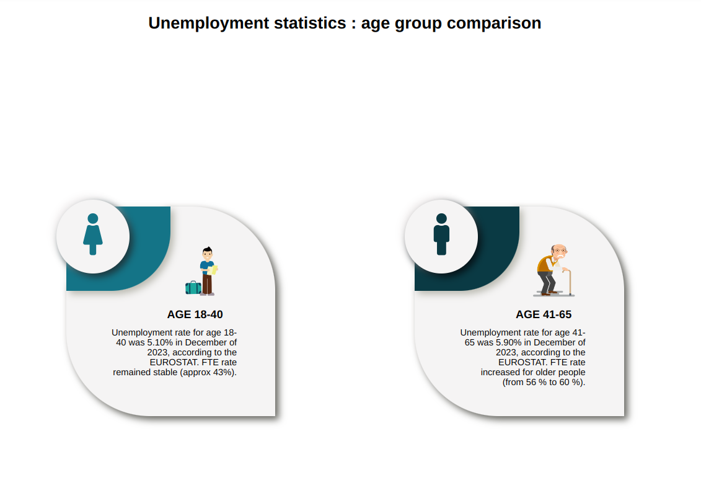
                        </li>
                        <li class="pictures" style="list-style: none">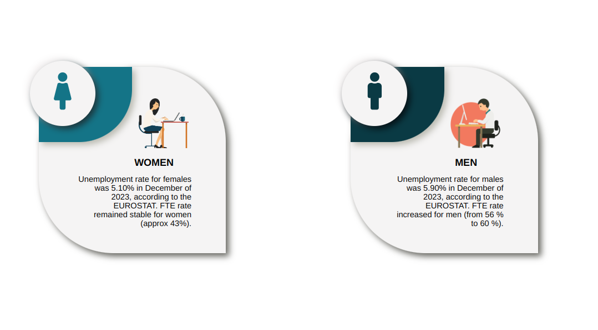
                        </li>
                    </ul>
                </li>
                <li id="timeTracking"><b>Pagina cu graficul în funcție de perioada de timp</b></li>
                <li style="list-style: none">
                    <ul>
                        <li>Pagina conține un grafic interactiv (care se poate mări, micșora, descărca, etc) care măsoară procentul șomajului în Romania în funcție de perioadă.</li>
                        <li class="pictures" style="list-style: none">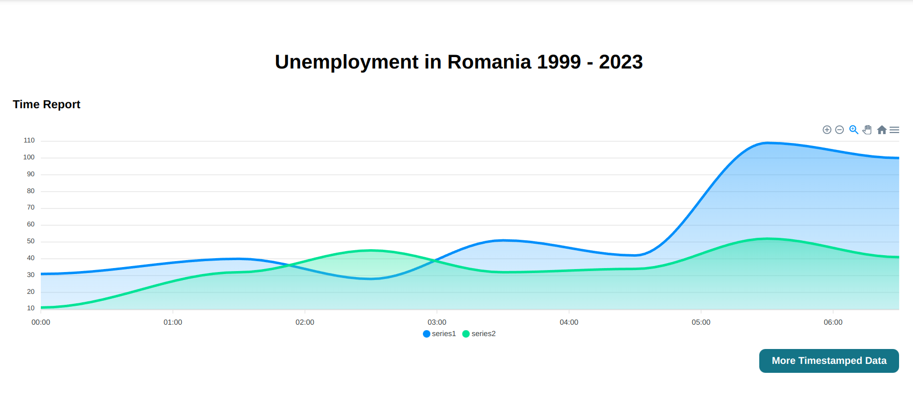
                        </li>
                    </ul>
                <li id="map"><b>Pagina cu harta șomajului din România pe județe</b></li>
                <li style="list-style: none">
                    <ul>
                        <li>Pagina conține o hartă a României care este clickable în funcție de fiecare județ.</li>
                        <li> Pentru a accesa paginile separate pentru fiecare județ, se va face click pe regiunea de pe hartă corespunzătoare județului, urmând să vizualizeze o nouă pagină cu informații cumulate strict despre acel județ selectat.
                        </li>
                        <li class="pictures" style="list-style: none">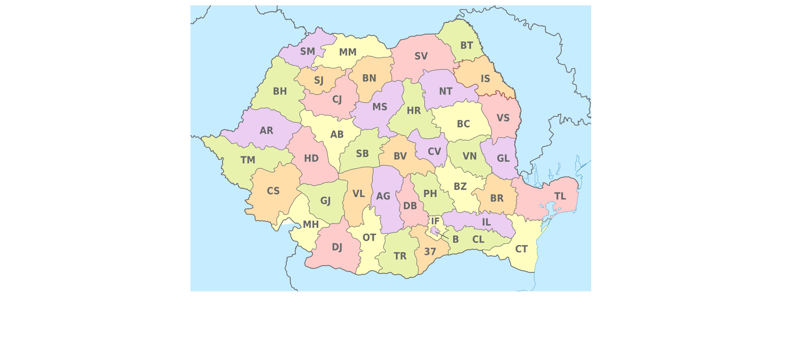</li>
                        <li class="pictures" style="list-style: none">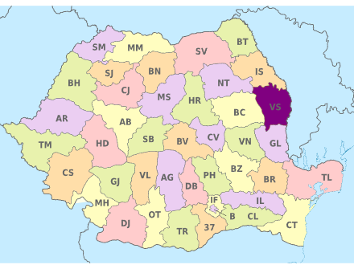</li>
                        <li class="pictures" style="list-style: none">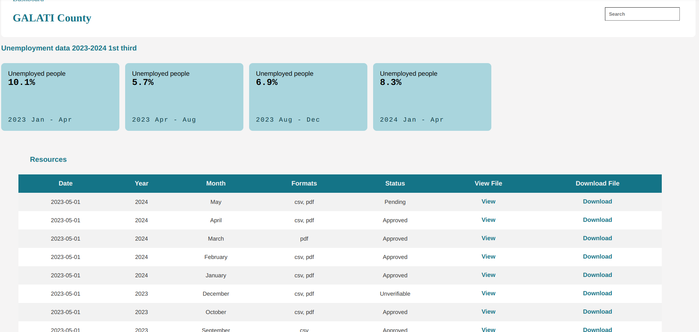</li>
                    </ul>
                </li>
                <li id="all-data"><b>Pagina de Unemployment Data - un fel de Dashboard al site-ului cu toate datele </b></li>
                <li style="list-style: none">
                    <ul>
                        <li>Pagina prezintă o un grid cu toate modurile de vizualizare a datelor și cu link-ul către Community Reports.</li>
                        <li class="pictures" style="list-style: none">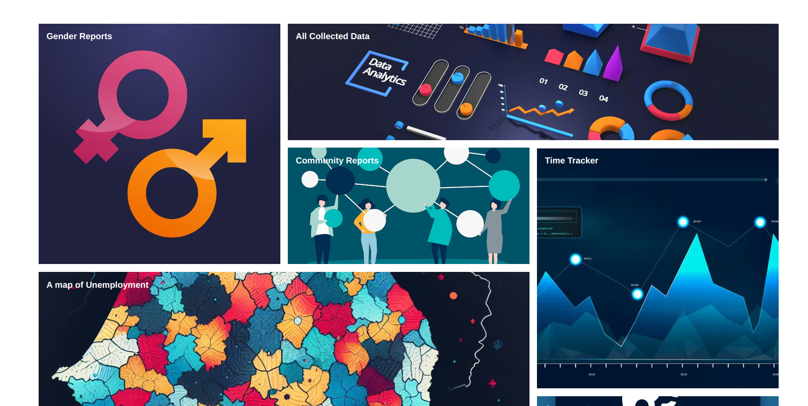</li>
                    </ul>
                </li>
                <li id="about"><b>Pagina informativa</b></li>
                <li style="list-style: none">
                    <ul>
                        <li>Pagina are rolul de a introduce site-ul UnX pe scurt, prin menționarea unor mici detalii despre site și despre autorii acestuia.
                        </li>
                        <li class="pictures" style="list-style: none">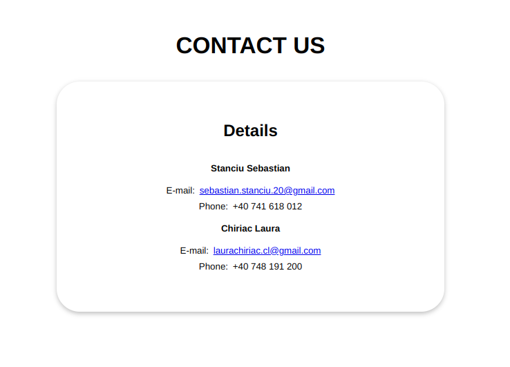
                        </li>
                    </ul>
            </ul>
            <section id="hardware-interface">
                <h4>3.2 Interfața Hardware</h4>
                

                    Acest produs nu necesită interfețe hardware, funcționând pe orice platformă (calculatoare,
                    laptopuri, telefoane etc.), care are instalată un browser.
                

            </section>
            <section id="software-interface">
                <h4>3.3 Interfața Software</h4>
                

                    Cerințele minime de software includ un browser funcțional, compatibil cu HTML5 și cu JavaScript.
                <h5>MySql Database</h5>
                Aceasta reprezintă baza de date în care stocăm informații despre fiecare utilizator, fiecare județ, despre fiecare document de pe site și sursă de informație, dar 
                și despre datele înregistrate de utilizatori. 
            </section>
            <section id="communication-interface">
                <h4>3.4 Interfața de comunicare</h4>
                

                    Aplicația necesită o conexiune la internet. Standardul de comunicare care va fi utilizat este HTTP.
                

            </section>
        <section id="system-features">
            

            <h2> Caracteristici principale ale sistemului </h2>
                <ul>
                    <li><b>Acces la diferite tipuri de date, cu diverse forme de vizualizare</b> - această caracteristică permite utilizatorilor să acceseze date și să le vizualizeze în grafice, în format cartografic.</li>
                    <li><b>Export de date</b> - utilizatorii pot exporta toate datele de pe site, în principal în formatele PNG/PDF, SVG, CSV pentru diferite tipuri de date. Aceasta este una dintre prioritățile de top ca funcționalitate a aplicației noastre.</li>
                    <li><b>Raportare date - DOAR PENTRU UTILIZATORII AUTENTIFICAȚI</b> - utilizatorii pot face rapoarte despre conținutul site-ului, ca formă de feedback privind datele de pe site.</li>
                    <li><b>Vizualizare grafică cu analiză personalizată a datelor</b> - utilizatorii pot selecta ce elemente doresc să vadă într-un anumit grafic și ce nu doresc să vadă. Ei pot chiar alege să vadă un canvas gol, dacă doresc.</li>
                </ul>
            

        </section>    
        <section id="non-functional">
            

                <h2> Funcționalități pentru protecție și securitate </h2>
                    <ul>
                        <li>Criptarea parolei în baza de date</li>
                        <li>Login si Register funcționale</li>
                        <li>Prevenția sql injection prin lucru cu baza de date folosind "prepare", dar și alte mijloace de prevenție</li>
                        <li>Verificarea user-ului la crearea unui nou Raport</li>
                    </ul>
            

        </section>
</article>
</body>
</html>
